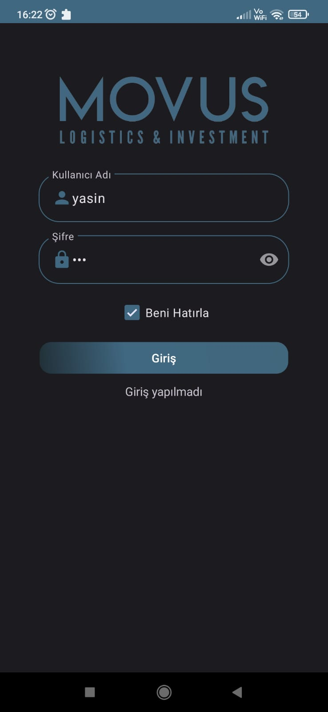
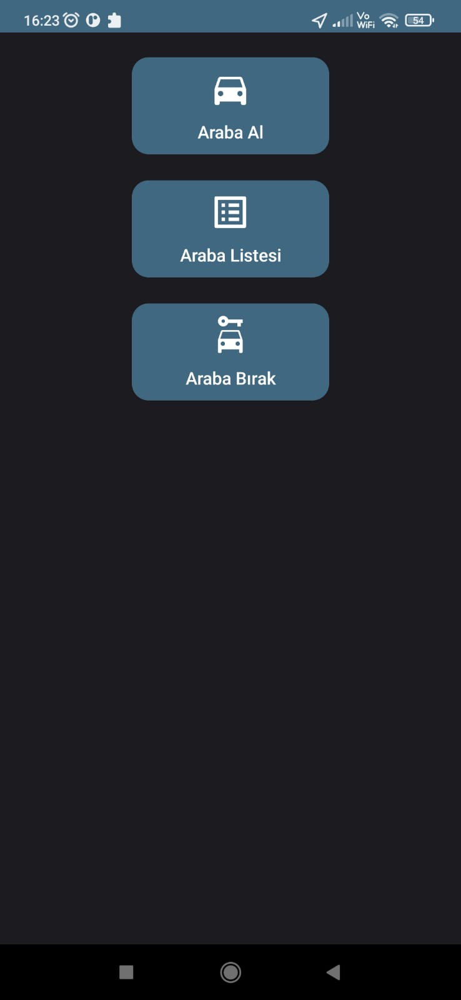
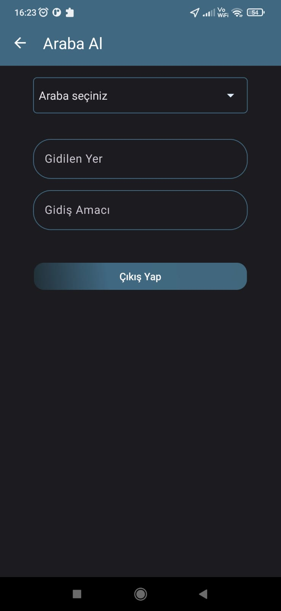
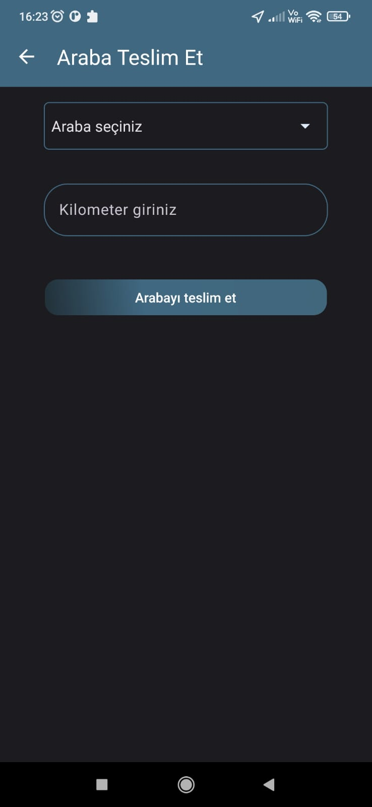
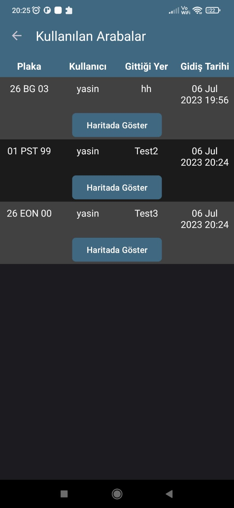

# Movus Android

Movus Android App is a logistics management application developed using Java, Retrofit, and MVVM architecture. It allows users to login, take cars, return cars, and view the list of available cars. The app integrates with an API to fetch data and perform operations.

# Features

   1. Rent a Car: Allows users to rent a company car by selecting from a list of available cars, providing the destination and purpose of the trip.
   2. Real-time Car Availability: Fetches the list of available cars from a remote server to ensure up-to-date information.
   3. Integration with Backend: Communicates with a backend server via Retrofit to fetch car data, insert rental information, and delete car records.
   4. User-friendly Interface: Utilizes spinners, text inputs, and dialog boxes to guide users and provide feedback on their actions.

# Getting Started

To run the app on your local machine, follow these steps:

    Clone the repository: git clone https://github.com/YasinOkat/MovusAndroidApp.git
   1. Open the project in Android Studio.
   2. Build and run the app on an emulator or physical device.
   3. Make sure to update the URL constants in the code to match the URL of your backend server.

# Screenshots

  
  

  
  

  

# Dependencies

The app uses the following dependencies:

    androidx.appcompat:appcompat: AndroidX AppCompat library for supporting older Android versions.
    androidx.lifecycle:lifecycle-viewmodel: AndroidX ViewModel library for managing UI-related data in a lifecycle-aware way.
    androidx.lifecycle:lifecycle-runtime: AndroidX Lifecycle library for handling the lifecycle of components.
    com.squareup.retrofit2:retrofit: Retrofit library for making HTTP requests and handling API responses.
    com.squareup.retrofit2:converter-gson: Gson converter for Retrofit to parse JSON responses.
    com.google.android.material:material: Material Components library for implementing Material Design components.
    androidx.recyclerview:recyclerview: AndroidX RecyclerView library for displaying scrollable lists.

# API Endpoints

The app interacts with the following API endpoints on the backend server:

    /login: Used for user authentication and returning login status.
    /getCars: Used to fetch the list of available cars.
    /take_car: Used to take a car for a specific purpose and destination.
    /return_car: Used to return a previously taken car.
    /getUsedCars: Used to fetch the lift of currently used cars.

# License

This project is licensed under the GNU General Public License (GPL). See the LICENSE file for more information.
